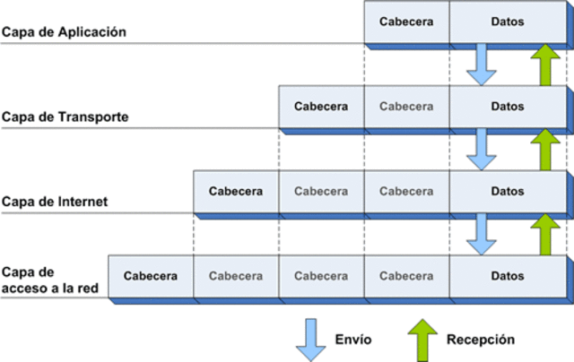

# Comunicaciones en red 
- [Introducción](#introducci-n)
  * [Elementos de la comunicación](#elementos-de-la-comunicaci-n)
  * [Arquitectura cliente/servidor](#arquitectura-cliente-servidor)
- [Arquitectura de redes](#arquitectura-de-redes)
  * [Modelo de referencia OSI](#modelo-de-referencia-osi)
  * [Modelo TCP/IP](#modelo-tcp-ip)
  * [Arquitectura en niveles o capas](#arquitectura-en-niveles-o-capas)
- [Arquitectura TCP/IP](#arquitectura-tcp-ip)
  * [Nivel de aplicación](#nivel-de-aplicaci-n)
  * [Nivel de transporte](#nivel-de-transporte)
    + [Protocolo TCP](#protocolo-tcp)
    + [Protocolo UDP](#protocolo-udp)
  * [Nivel de Internet](#nivel-de-internet)
- [Bibliografía](#bibliograf-a)
## Introducción
Las redes permiten interconectar los ordenadores físicamente con el objetivo de que se puedan comunicar entre ellos. Hoy en día la gran mayoría de aplicaciones hacen uso de estas redes para compartir información (chats, streaming de video, almacenamiento en la nube, etc.). 

Como veremos el proceso de comunicación es complejo pero los lenguajes de programación como Java simplifican mucho esta tarea a los programadores. 

### Elementos de la comunicación

Los elementos que participan toda comunicación son:
- Emisor: Agente que genera la información y la transfiere al medio.
- Receptor: Agente que recibe la información a través del medio.
- Mensaje: Información que se transmite.
- Canal o medio: Elemento físico que transmite el mensaje.
- Código: Sistema de señales o signos utilizados para transmitir el mensaje

### Arquitectura cliente/servidor

La arquitectura cliente/servidor es el modelo más utilizado para realizar la comunicación entre dispositivos.

Se trata de un modelo de diseño de software en el que las tareas se reparten entre los proveedores de recursos o servicios, llamados servidores, y los demandantes, llamados clientes.

El **servidor** es el dispositivo que ofrece un servicio como por ejemplo compartir un recurso. Los servidores permanecen a la espera de que un cliente se conecte y les hagan peticiones. Un ejemplo clásico son los servidores web.

Por su parte el **cliente** es el dispositivo que hace uso de los servicios ofrecidos por los servidores. Se conecta a ellos para hacerles peticiones. Un ejemplo son los navegadores de Internet.

<div style="text-align: center">

</div>

## Arquitectura de redes

A finales de los años 70 los fabricantes desarrollaban diferentes dispositivos para crear redes privadas. En aquella época no se pensaba en la compatibilidad de hardware y software entre fabricantes por lo que los dispositivos solo funcionaban si se conectaban a otros dispositivos del mismo fabricante.

### Modelo de referencia OSI

En 1983 la Organización Internacional de Estándares ISO (International Organization for Standardization) desarrolla el modelo de Interconexión de Sistemas Abiertos OSI (Open Systems Interconnection) con el que pretende normalizar la comunicación entre dispositivos.

OSI es un modelo conceptual, esto quiere decir que ofrece los fundamentos de diseño, pero no define sus protocolos. Estructura el proceso de comunicación en siete niveles o capas que interaccionan entre sí. 

> Un protocolo es un sistema de reglas que permiten que dos o más dispositivos se comuniquen entre ellos.

### Modelo TCP/IP

Desde finales de los años 70, esto es varios años antes del desarrollo del modelo OSI, la Agencia de Proyectos de Investigación Avanzados de Defensa  (DARPA) perteneciente al Departamento de Defensa de los Estados Unidos había estado trabajando en la red ARPANET con el objetivo de interconectar diferentes instituciones académicas. ARPANET hacía uso de la arquitectura TCP/IP imponiéndose al modelo OSI.

Si queréis saber más sobre el tema:

[Breve historia de cómo TCP/IP se impuso a OSI Parte 1](https://www.javiergarzas.com/2013/09/tcpip-se-impuso-a-osi-1.html)

[Breve historia de cómo TCP/IP se impuso a OSI Parte 2](https://www.javiergarzas.com/2013/09/tcpip-se-impuso-a-osi-2.html)

### Arquitectura en niveles o capas

Tanto el modelo OSI como la arquitectura TCP/IP se basan en niveles o capas. Cada capa proporciona servicios a la capa contigua superior y utiliza los servicios que le presta la capa contigua inferior. De esta forma el problema de comunicar dos dispositivos se divide en subproblemas más pequeños y por tanto más manejables.

[¿Por qué estructurar la arquitectura en niveles o capas?](./res/modelo_niveles.pdf)

## Arquitectura TCP/IP

La arquitectura TCP/IP está compuesta por cuatro niveles: aplicación, transporte, Internet y acceso a la red.

Al enviar datos cada nivel añade una serie de cabeceras a los datos. Dicha cabecera incluye información relevante para los protocolos del propio nivel. Al recibir los datos estas cabeceras se van quitando.

<div style="text-align: center">

</div>

### Nivel de aplicación

Este nivel es el más alto y definen los protocolos que  utilizan las aplicaciones para comunicarse tales como HTTP, FTP, IMAP, SMTP o DNS.

> El navegador web utiliza un protocolo de la capa o nivel de aplicación llamado HTTP.

A continuación, se muestra un ejemplo de mensaje HTTP que podría enviar un servidor web a un cliente como respuesta a una petición.

```
HTTP/1.1 200 OK
Date: Mon, 27 Jul 2009 12:28:53 GMT
Server: Apache/2.2.14 (Win32)
Last-Modified: Wed, 22 Jul 2009 19:15:56 GMT
Content-Length: 88
Content-Type: text/html
<html>
<body>
<h1>Hello, World!</h1>
</body>
</html>
```

Este mensaje se compone de una cabecera:

```
HTTP/1.1 200 OK
Date: Mon, 27 Jul 2009 12:28:53 GMT
Server: Apache/2.2.14 (Win32)
Last-Modified: Wed, 22 Jul 2009 19:15:56 GMT
Content-Length: 88
Content-Type: text/html
```

Que incluye información relativa a la fecha y hora en la que se envió el mensaje, la longitud del cuerpo del mensaje y su tipo, etc.

Por otro lado tenemos el cuerpo:

```
<html>
<body>
<h1>Hello, World!</h1>
</body>
</html>
```
Que incluye el contenido del mensaje.

### Nivel de transporte

El nivel de transporte recibe el mensaje del nivel de aplicación, lo divide en segmentos y añade una cabecera a cada uno de ellos.

Este nivel se encarga de entregar la información a la aplicación destino. Pero, ¿cómo puede saber la capa de transporte a qué aplicación debe entregar los datos?

El proceso de decidir a qué aplicación entregar el segmento recibe el nombre de demultiplexación. Para llevarlo a cabo se hace uso de los puertos, números que permiten identificar el origen/destino entre aplicaciones.

El puerto de origen y destino es uno de los datos que se incluyen en la cabecera del segmento. Se utilizan 16 bits para el puerto de origen y otros 16 para el puerto de destino. Por tanto existen 65536 puertos, que van del 0 al 65535. Los puertos inferiores al 1024 son los puertos bien conocidos y están reservados para el sistema operativo y usados por "protocolos bien conocidos". Por ejemplo, el puerto 21 es utilizado por los servidores FTP y el 80 por los servidores web.

Los protocolos de este nivel son TCP (Transmission Control Protocol) y UDP (User Datagram Protocol).

#### Protocolo TCP

Este nivel se encarga de que los paquetes lleguen en secuencia y sin errores desde la aplicación de origen hasta la aplicación de destino.

Las principales características del protocolo son:
- Es un protocolo orientado a la conexión.
- Demultiplexa los datos.
- Asegura el orden de los segmentos  y que los datos llegan a su destino.
- Asegura que llegan sin errores. 
- Evita la saturación de la red (control de flujo).


#### Protocolo UDP

Las principales características del protocolo son:
- Es un protocolo no orientado a la conexión.
- Demultiplexa los datos.
- No asegura que los datos lleguen a su destino.
- No asegura que lleguen sin errores. 
- No lleva a cabo control de flujo.

### Nivel de Internet

El nivel de Internet recibe los segmentos del nivel de transporte, los divide en datagramas y añade a cada uno de ellos una cabecera.

Permite el envío de datos desde un dispositivo origen a un dispositivo destino a través de una red. El principal protocolo de este nivel es el **protocolo IP** que se caracteriza por:

- Ser un protocolo no orientado a conexión, esto significa que los datos se transmiten sin necesidad de anunciar previamente que se van a enviar o requerir que se acepte la conexión.
- La entrega de datos es no confiable, nada asegura que vayan a llegar.
- Solo proporciona mecanismos de detección de errores en sus cabeceras, no asegura que los datos del cuerpo del mensaje vayan a llegar bien.
- Hace uso de las direcciones IP para identificar las interfaces (dispositivos que se pueden comunicar).
- Mediante mecanismos de enrutamiento se decide el camino que deben seguir los paquetes para llegar a su destino.

La direcciones IP están compuestas por 32 bits que permiten identificar de forma única una interfaz de red. Las cabeceras de los datagramas IP incluyen la dirección IP de origen y las direcciones IP de destino.

## Bibliografía
https://ioc.xtec.cat/materials/FP/Recursos/fp_dam_m09_/web/fp_dam_m09_htmlindex/WebContent/u2/a1/continguts.html