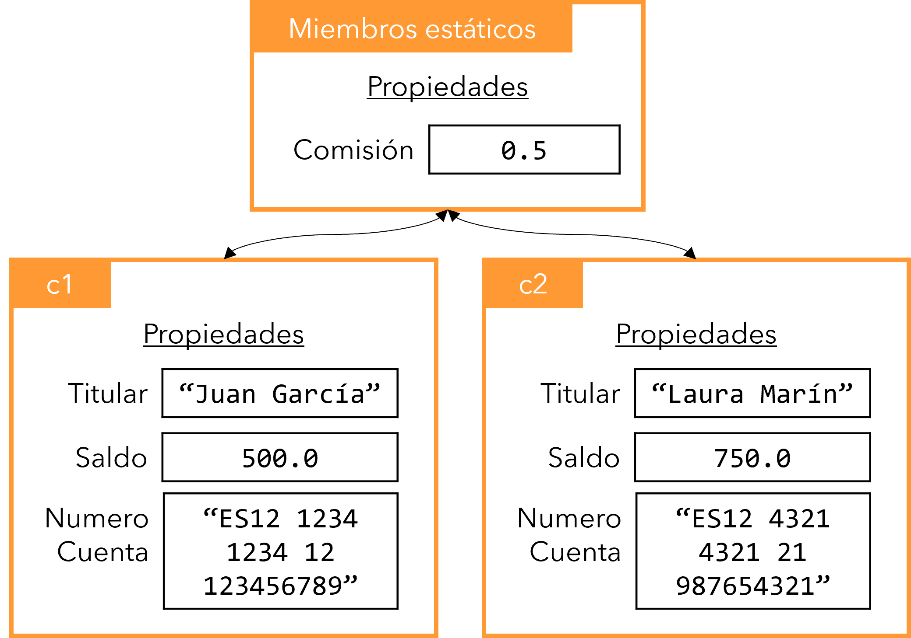

# Programación Orientada a Objetos
  * [Introducción](#introducción)
  * [Clases](#clases)
  * [Campos o atributos](#campos-o-atributos)
    + [Ámbito de los atributos.](#-ámbito-de-los-atributos)
  * [Métodos](#métodos)
    + [Ocultación de atributos](#ocultación-de-atributos)
    + [La clase Program](#la-clase-program)
  * [Objetos](#objetos)
    + [Creación de una instancia](#creación-de-una-instancia)
  * [Modificadores de accesibilidad](#modificadores-de-accesibilidad)
    + [Modificadores de accesibilidad para clases](#modificadores-de-accesibilidad-para-clases)
    + [Modificadores de acceso para miembros](#modificadores-de-acceso-para-miembros)
  * [Getters y Setters](#getters-y-setters)
  * [Propiedades](#propiedades)
    + [Propiedades automáticas](#propiedades-automáticas)
  * [Constructores](#constructores)
    + [Constructor por defecto](#constructor-por-defecto)
  * [Miembros estáticos](#miembros-estáticos)

## Introducción

La programación orientada a objetos, en adelante POO, es un paradigma de programación que tiene por objeto estructurar el código de forma similar a cómo el ser humano organiza y clasifica la realidad que le rodea. De esta forma se busca que el código sea más fácil de organizar, comprender y por tanto mantener.

La POO se basa en organizar el código en módulos denominados clases en las que se definen las características y comportamientos que tienen en común sus instancias o ejemplares.

Como su nombre indica, la POO gira entorno al concepto de objeto. Así pues, un programa en ejecución consta de una serie de objetos relacionados que se comunican entre sí.

## Clases

Las clases son una especie de plantillas que nos permiten definir cuáles son las características y comportamientos de los objetos creados a partir de ellas. Podemos ver las clases como los moldes que nos permiten crear los objetos.

La sintaxis de una clase es la siguiente:
```csharp
class NombreClase{
    // definición de la clase
}
```
Donde _NombreClase_ es el nombre de la clase.

> Los nombres de las clases siempre empiezan en mayúscula.

Dentro de la clase definiremos sus características mediante el uso de **campos o atributos** y sus comportamientos mediante el uso de **métodos**.

Para continuar con la explicación pondremos un ejemplo que desarrollaremos a lo largo de la unidad. Imaginemos que vamos a desarrollar un programa para gestionar cuentas bancarias. Podríamos definir las siguientes características y comportamientos:

- Características: número de cuenta, titular y saldo.
- Comportamientos: realizar ingreso, realizar reintegro, cambiar titular y obtener información.

Por supuesto, se nos podrían ocurrir mil características y comportamientos mas, cuáles vamos a considerar en nuestro programa dependerá del problema que queramos resolver.

## Campos o atributos

Mediante los campos o atributos representamos las características de los objetos. La sintaxis general es la siguiente:

```csharp
    class NombreClase{
        tipo atributo1;
        tipo atributo2;
        ...
    }
```
Donde _tipo_ es el tipo del atributo y _atributo1_ su identificador. Como podemos ver, no dejan de ser declaraciones de variables.

Podemos inicializar los atributos con un valor por defecto de la siguiente forma:

```csharp
    class NombreClase{
        tipo atributo1 = valor;
        ...
    }
```
Los atributos son variables que están declaradas dentro de la clase, pero fuera de los métodos. Siempre los declararemos al inicio de la clase, antes de los métodos.

A continuación, se muestra la clase _Cuenta_ con sus atributos:

```csharp
class Cuenta{
    string numeroCuenta;
    string titular;
    float saldo;
}
```

### Ámbito de los atributos.

Como ocurre con el resto de variables, el ámbito de los atributos viene determinado por el bloque de llaves {} que lo contiene, por tanto los atributos pueden ser accedidos desde cualquier método de la clase.

## Métodos

Los comportamientos de los objetos se definen mediante el uso de métodos, que no son más que funciones que se implementan dentro de una clase.

A continuación, se muestra la clase _Cuenta_ incluyendo los métodos realizar ingreso, realizar reintegro, cambiar titular y obtener información.

```csharp
class Cuenta
{
    string numeroCuenta;
    string titular;
    float saldo;

    public void Ingresar(float cantidad)
    {
        saldo = saldo + cantidad;
    }

    public void Reintegrar(float cantidad)
    {
        saldo = saldo - cantidad;
    }

    public void CambiarTitular (string nuevoTitular)
    {
        titular = nuevoTitular;
    }

    public string ObtenerInformacion()
    {
       return numeroCuenta + " " + titular + " " + saldo + "€";
    }
}
```
Como se puede ver en el ejemplo anterior, los atributos son variables accesibles desde cualquier método.

> Al conjunto de atributos y métodos de una clase se le llama **miembros** de la clase.

> Las variables declaradas dentro de un método reciben el nombre de **variables locales**.

### Ocultación de atributos

Hasta ahora hemos visto que no podemos declarar dos variables con el mismo identificador si se encuentran en el mismo ámbito o en ámbitos anidados.

```csharp
int n = int.Parse(Console.ReadLine());
if(n > 10)
{
    int n = 10; // Error: la variable n ya se ha declarado
}
```
```csharp
public void GenerarNumero(int n)
{
    int n = int.Parse(Console.ReadLine()); // Error: la variable n ya se ha declarado
}
```

Sin embargo, existe una excepción: dentro de un método podemos declarar una variable con el mismo identificador que un atributo de la clase.

```csharp
class Articulo
{
    string nombre = "Pepito";

    public void MostrarNombre(string nombre) // No se produce un error
    {
        nombre = "Juanito";
        Console.WriteLine(nombre);
    }
}
```
En el ejemplo anterior, dentro del método _MostrarNombre_ ¿A qué variable se hace referencia cuando se utiliza la variable _nombre_?¿A la variable local, esto es, al parámetro del método o al atributo de la clase?.

Ante esta situación las variables locales tienen prioridad sobre el atributo. Se dice que la variable local **oculta al atributo**.

Por tanto, si llamamos al método _MostrarNombre_ se mostrará por pantalla _"Juanito"_ y el atributo _nombre_ seguirá valiendo _"Pepito"_.

Ante esta situación, ¿Cómo podemos hacer referencia al atributo en vez de la variable local? Para ello disponemos de la palabra reservada _this_ que permite hacer referencia a un atributo de la clase incluso cuando ha sido ocultado por una variable local.

A continuación, se muestra un ejemplo de uso de la palabra reservada _this_.

```csharp
class Cuenta
{
    string numeroCuenta;
    string titular;
    float saldo;

    ...

    public void CambiarTitular (string titular)
    {
        this.titular = titular;
    }

    ...    

}
```
El ejemplo anterior _this.titular_ hace referencia al atributo _titular_, mientras que _titular_ hace referencia al parámetro del método. De esta forma es posible diferenciar a qué variable estamos haciendo referencia.

### La clase Program

Al crear una aplicación de consola siempre se crea un archivo _Program.cs_ que define una clase _Program_ con un método llamado _Main_. Así pues, en esta clase podemos declarar los campos y métodos que queramos. El método _Main_ es el primero que se ejecuta al lanzar el programa y se denomina punto de entrada del programa.

## Objetos

Hasta ahora hemos visto cómo crear las "plantillas" o "moldes" que nos van a permitir crear objetos. En  una clase hemos definido las características y comportamientos de una cuenta bancaria, pero aún no hemos creado ninguna.

### Creación de una instancia

Los elementos creados a partir de una clase se llaman **instancias** u **objetos**. Todos los objetos creados a partir de una clase tienen los mismos atributos y métodos, pero los atributos de cada objeto tienen sus propios valores.

Para **crear una instancia** de una clase en primer lugar es necesario declarar una variable. En el tipo de la variable escribiremos el nombre de la clase.

```csharp
NombreClase nombreVariable;
```
La variable _nombreVariable_ está declarada, pero no inicializada. Para poder utilizar la variable es imprescindible inicializarla. Para ello utilizaremos el operador _new_.

```csharp
nombreVariable = new NombreClase();
```
Por supuesto, podríamos haber declarado e inicializado la variable en una única línea:

```csharp
NombreClase nombreVariable = new NombreClase();
```

A partir de ahora, si se cumplen ciertas condiciones que veremos más adelante, podremos acceder a los atributos y métodos de la instancia mediante el uso de un punto tras el nombre de la variable como se muestra a continuación:

```csharp
NombreClase nombreVariable = new NombreClase();
nombreVariable.atributo1 = nuevoValor; // Asignamos un nuevo valor al atributo atributo1
Console.WriteLine(nombreVariable.atributo1); // Mostramos el valor del atributo atirbuto1
nombreVariable.metodo1(); // Llamamos al método metodo1 de la variable nombreVariable
```
Siguiendo con el ejemplo de las cuentas bancarias vamos a crear varias instancias de la clase _Cuenta_ en el método _Main_:

```csharp
static void Main(string[] args)
{
    Cuenta c1 = new Cuenta();
    Cuenta c2 = new Cuenta();

    c1.CambiarTitular("Andresito");
    c1.Ingresar(100);

    c2.CambiarTitular("Laurita");
    c2.Ingresar(200);

    Console.WriteLine(c2.ObtenerInformacion());
}
```
En el código anterior se crean dos instancias de la clase _Cuenta_. El titular de la primera cuenta pasa a ser Andresito quien ingresa 100€. La segunda cuenta pasa a ser de Laurita, quien hace un ingreso de 200€.Finalmente se muestra la información de la segunda cuenta por pantalla. Todas estas operaciones se realizan mediante llamadas a los métodos de la instancia.

Si intentamos acceder a los atributos del mismo modo que hemos hecho con los métodos, veremos que se produce un error que nos indica que el atributo _saldo_ es inaccesible.

```csharp
static void Main(string[] args)
{
    Cuenta c1 = new Cuenta();
    c1.saldo = 500; // Error, el campo saldo no es accesible
    Console.WriteLine(c1.saldo); // Error, el campo saldo no es accesible
}
```
Esto se debe a que no siempre podemos acceder a los campos y métodos de una instancia desde otra clase. Que podamos hacerlo o no depende del modificador de accesibilidad utilizado a la hora de declarar los miembros.

## Modificadores de accesibilidad

Las clases y sus miembros serán visibles o accesibles por otras clases en función de los modificadores de accesibilidad utilizados.

### Modificadores de accesibilidad para clases

Los modificadores de accesibilidad que podemos aplicar a una clase en C# son los siguientes:

- _public_: La clase es accesible desde cualquier clase del propio proyecto o de otro proyecto.
- _internal_: La clase es accesible desde cualquier otra clase del propio proyecto pero no desde proyectos externos.

Que una clase sea accesible significa que puede ser instanciada.

El modificador de accesibilidad se especifica antes de la palabra reservada _class_.

```csharp
accesibilidad class NombreClase {
    ...
}
```
Por ejemplo:

```csharp
public class Empleado {
    ...
}
```
Si no indicamos el modificador de accesibilidad por defecto será _internal_.

### Modificadores de acceso para miembros

Los modificadores de acceso disponibles en C# son los siguientes:

- _public_: El campo o método es accesible desde cualquier clase del propio proyecto o de otro proyecto.
- _private_: El campo o método solo es accesible desde la propia clase.
- _protected_: El campo o método es accesible desde la propia clase y cualquier otra clase derivada.
- _internal_: El campo o método es accesible desde cualquier clase del propio proyecto pero no desde proyectos externos.

En el caso de los campos el modificador de accesibilidad se especifica antes del tipo.

```csharp
accesibilidad tipo identificadorAtributo;
```
Por ejemplo:

```csharp
public int edad;
```

En el caso de los métodos el modificador de accesibilidad se indica antes del tipo devuelto.

```csharp
accesibilidad tipoDevuelto NombreMetodo (tipoParametro1 nombreParametro1, … ) 
```
Por ejemplo:

```csharp
public int Sumar(int num1, int num2){
    ...
}
```
Que un método sea accesible significa que puede ser llamado. Que un campo sea accesible significa que se puede obtener o asignar un valor.

Si no indicamos el modificador  de accesibilidad de un miembro por defecto será _private_.

Si observamos el código de la clase _Cuenta_. Vemos que los atributos _numeroCuenta_, _titular_ y _saldo_ no tienen modificador de accesibilidad, por lo que por defecto su accesibilidad es _private_.


```csharp
class Cuenta
{
    string numeroCuenta;
    string titular;
    float saldo;   
    ...
}
```

Éste es el motivo por el que el siguiente código producía un error:

```csharp
static void Main(string[] args)
{
    Cuenta c1 = new Cuenta();
    c1.saldo = 500; // Error, el campo saldo no es accesible
    Console.WriteLine(c1.saldo); // Error, el campo saldo no es accesible
}
```
No podemos acceder al campo _saldo_ desde otra clase porque es privado. Este error se soluciona si añadimos el modificador de accesibilidad _public_ al campo _saldo_:

```csharp
class Cuenta
{
    string numeroCuenta;
    string titular;
    public float saldo;
    ...
}
```
Podríamos pensar que para evitar problemas lo mejor sería que todos los campos fueran públicos. No obstante **no es una práctica recomendada**. ¿Por qué? Porque un campo público puede ser modificado desde cualquier lugar del programa con el inconveniente de que alguien podría asignar un valor inválido.

Imaginemos que no queremos que el saldo de las cuentas pueda ser inferior a 0. Si el campo es público nada impide que otro programador haga:

```csharp
static void Main(string[] args)
{
    Cuenta c1 = new Cuenta();
    c1.saldo = -200; // Asignamos un valor inválido
}
```

C# soluciona este problema con las denominadas **propiedades**. Otros lenguajes como Java hacen uso de los denominados _getters_ y _setters_. En ambos casos el principio es similar.

## Getters y Setters

Esta solución es la que se utiliza en _Java_. Consiste en que los campos o atributos sean siempre privados. Para acceder a ellos se utilizan métodos _set_ y _get_.

A continuación, se muestra la clase _Cuenta_ programada en Java (podéis ver que la sintaxis es casi idéntica a C#).

```java
public class Cuenta
{
    ... 
    private float saldo;
    ...

    public void setSaldo(float saldo){
        if(saldo > 0){
            this.saldo = saldo;
        }
    }
    
    public float getSaldo(){
        return saldo;
    }
    ...
}
```
Para obtener el valor del atributo _saldo_ se hace uso del método _getSaldo_ y para modificarlo el método _setSaldo_. Hacer uso de métodos nos permite escribir código para, entre otras cosas, controlar que el valor que se vaya asignar a un campo sea válido. A continuación, se muestra el uso de estos métodos:

```java
public static void main(String[] args)
{
    Cuenta c1 = new Cuenta();
    c1.saldo = -200; // Error, el atributo saldo no es accesible
    c1.setSaldo(200); // El saldo de la cuenta pasa a ser 200
    c1.setSaldo(-500); // El saldo no se modifica ya que el valor -500 no es superior a 0.
    System.out.println(c1.getSaldo()); // Mostramos el saldo por pantalla
}
```

## Propiedades

C# introduce el concepto de propiedades que, como veremos, es un concepto similar al de los _getters_ y _setters_ de Java pero con una sintaxis diferente.

Una propiedad C# se define de la siguiente forma:

```csharp
private float saldo;
public float Saldo
{
   get { return saldo; }
   set { 
       if(value > 0){
           saldo = value;
       }
    }
}
```
Donde:
-	_saldo_ es un campo. Los campos siempre serán privados.
-	_Saldo_ es una **propiedad** que permite obtener y asignar el campo _saldo_.
-	Entre llaves {} especificamos el _getter_ y _setter_ de la propiedad. Como vemos no se escriben los paréntesis como se haría en un método normal.
-	La palabra clave _value_ representa el valor que recibe como entrada el _setter_ y es del mismo tipo que el indicado en la propiedad.
-	Tanto en el _setter_ como en el _getter_ podemos programar la lógica necesaria para tratar los datos, por ejemplo, comprobando que el nuevo saldo sea superior a 0.

La propiedad _Saldo_ se utilizaría del siguiente modo:

```csharp
static void Main(string[] args)
{
    Cuenta c1 = new Cuenta();
    c1.saldo = 200; // Error, no podemos acceder al campo saldo ya que es privado
    // Debemos acceder a través  de la propiedad:
    c1.Saldo = 500; // El saldo pasa a ser 500
    c1.Saldo = -200; // El saldo no se modifica, ya que el valor -200 no es superior a 0
    Console.WriteLine(c1.Saldo); // Mostrará 500
}
```
### Propiedades automáticas

A veces no se quiere añadir ningún tipo de lógica en los _setters_ y _getters_. En esos casos se pueden utilizar **propiedades automáticas**, siguiendo la sintaxis:

```csharp
public string Titular { get; set; }
```

En este caso no es necesario especificar el campo privado _titular_ como sí hemos hecho a la hora de implementar la propiedad _Saldo_.

> A la hora de implementar nuestras clases siempre utilizaremos propiedades y nunca campos o atributos privados.

## Constructores

Cuando se instancia una clase los campos a los que no se les asigna un valor en su declaración se inicializan con un valor por defecto. En el caso de los tipos numéricos se inicializan con un 0, las referencias se inicializan a _null_ y los _booleanos_ con _false_. Por ejemplo, al instanciar la clase _Cuenta_ su saldo inicial siempre será 0.

Los constructores son métodos que permiten inicializar los objetos que se instancian.

Un constructor es un método especial que:
-	Tiene el mismo nombre que la clase.
-	Se define sin tipo devuelto (ni siquiera _void_).
-	Se ejecuta una única vez en el momento que se instancia la clase con el operador _new_.

Al constructor, como a cualquier otro método, se le pueden pasar parámetros.

Veamos un ejemplo con la clase _Cuenta_ en la que se define un constructor que recibe como parámetro el saldo inicial y se asigna a la propiedad correspondiente.

```csharp
class Cuenta
{
        string numeroCuenta;
        string titular;
        private float saldo;
        public float Saldo
        {
            get { return saldo; }
            set { 
                if(value > 0)
                {
                    saldo = value;
                }
            }
        }

        // Constructor
        public Cuenta(float saldo)
        {
            Saldo = saldo;
        }
}
```
Si queremos instanciar la clase ahora deberemos indicar obligatoriamente su saldo.

```csharp
static void Main(string[] args)
{
    Cuenta c1 = new Cuenta(500);
    Cuenta c2 = new Cuenta(); // Error, el constructor nos obliga a indicar el parámetro saldo. No podemos instanciar la clase de este modo.
    Console.WriteLine(c1.Saldo); // Mostrará 500
}
```
En una clase podemos tener múltiples constructores todos ellos con el mismo nombre pero con diferente número y/o tipo de parámetros de entrada. En este caso se dice que el constructor está **sobrecargado**.

```csharp
class Cuenta
{
    public float NumeroCuenta { get; set; }
    public string Titular { get; set; }

    private float saldo;
    public float Saldo
    {
        get { return saldo; }
        set { 
            if(value > 0)
            {
                saldo = value;
            }
        }
    }

    public Cuenta(float saldo)
    {
        Saldo = saldo;
    }

    public Cuenta(float saldo, string titular)
    {
        Saldo = saldo;
        Titular = titular;
    }

    public Cuenta(float saldo, string titular, string numerCuenta)
    {
        Saldo = saldo;
        Titular = titular;
        NumeroCuenta = NumeroCuenta;
    }
    ...
}
```

A partir de ahora podríamos instanciar la clase _Cuenta_ haciendo uso de cualquiera de los tres constructores.

### Constructor por defecto

Si no definimos ningún constructor, por defecto C# incluirá un constructor vacío que no recibe ningún parámetro ni tiene código en su cuerpo. Por eso podemos instanciar clases aunque no hayamos implementado ningún constructor.

## Miembros estáticos

Un miembro estático (ya sea un campo, propiedad o método) es aquel del que no existe una copia en cada objeto. Se trata de un miembro compartido por todas las instancias de la clase. Un miembro estático se declara mediante la palabra reservada _static_.

Imaginemos que queremos añadir una comisión mensual a nuestra clase _Cuenta_ y que queremos que dicha comisión sea la misma para todas las cuentas. En ese caso añadiremos una propiedad estática como se muestra a continuación:

```csharp
class Cuenta
{
    private static float comision;
    public static float Comision
    {
        get
        {
            return comision;
        }
        set
        {
            if (value > 0)
            {
                comision = value;
            }
        }
    }
    ...
}
```

 Para acceder a dicha propiedad no es necesario instanciar la clase sino que podemos acceder a ella simplemente escribiendo el nombre de la clase seguida de un punto y el nombre del miembro estático:

```csharp
Cuenta.Comision = 0.5f;
Cuenta c1 = new Cuenta(500, "Juan García", "ES12 1234 1234 12 123456789");
Cuenta c2 = new Cuenta(750, "Laura Marín", "ES12 1234 1234 12 123456789");
 ```           
La propiedad _Comision_ es compartida entre todas las instancias de la clase, por lo que al hacer _Cuenta.Comision = 0.5f;_ todas las cuentas tendrán una comisión de 50 céntimos.

<div style="text-align: center">

</div>

Un miembro estático puede ser accedido desde cualquier método aunque éste no sea estático. Por ejemplo, el método _AplicarComision_ que se muestra a continuación no es estático y hace uso de la propiedad estática _Comision_.

```csharp
class Cuenta
{
    ...
    public void AplicarComision()
    {
        Saldo -= Comision;
    }
    ...
}
```

También podemos tener métodos estáticos como el que se muestra a continuación:

```csharp
class Cuenta
{
    ...

    public static void DuplicarComision()
    {
        Comision *= 2;
    }
    ...
}
```
Los métodos estáticos solo pueden acceder o llamar a otros miembros que también sean estáticos.

A continuación, se muestra un ejemplo de uso de los diferentes métodos y propiedades estáticas.

```csharp
static void Main(string[] args)
{
    Cuenta.Comision = 0.5f;
    Cuenta c1 = new Cuenta(500, "Juan García", "ES12 1234 1234 12 123456789");
    c1.AplicarComision(); // Se aplica una comisión de 0,5€. El saldo pasa a ser 499.5

    Cuenta.DuplicarComision(); // La comisión de todas las cuentas pasa a ser 1€
    Cuenta c2 = new Cuenta(750, "Laura Marín", "ES12 1234 1234 12 123456789");

    c1.AplicarComision(); // Se aplica una comisión de 1€. El saldo pasa a ser 498.5
    c2.AplicarComision(); // Se aplica una comisión de 1€. El saldo pasa a ser 749

    Console.WriteLine("Cuenta 1: " + c1.Saldo);
    Console.WriteLine("Cuenta 2: " + c2.Saldo);

    Console.ReadKey();
}
```


