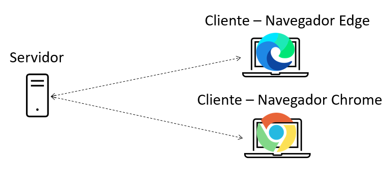
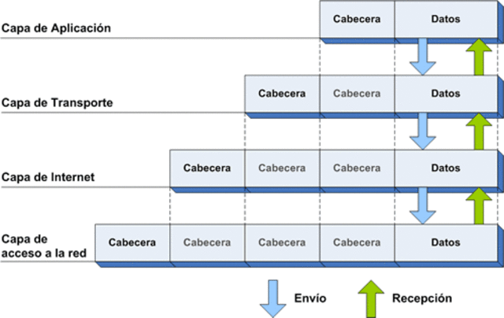

# Comunicaciones en red 

- [Comunicaciones en red](#comunicaciones-en-red)
  - [Introducción](#introducción)
  - [Conceptos teóricos](#conceptos-teóricos)
    - [Elementos de la comunicación](#elementos-de-la-comunicación)
    - [Arquitectura cliente/servidor](#arquitectura-clienteservidor)
    - [Arquitectura de redes](#arquitectura-de-redes)
      - [Modelo de referencia OSI](#modelo-de-referencia-osi)
      - [Arquitectura TCP/IP](#arquitectura-tcpip)
      - [Arquitectura en niveles o capas](#arquitectura-en-niveles-o-capas)
    - [Arquitectura TCP/IP](#arquitectura-tcpip-1)
      - [Nivel de acceso a la red](#nivel-de-acceso-a-la-red)
      - [Nivel de Internet](#nivel-de-internet)
      - [Nivel de transporte](#nivel-de-transporte)
        - [Protocolo TCP](#protocolo-tcp)
        - [Protocolo UDP](#protocolo-udp)
      - [Nivel de aplicación](#nivel-de-aplicación)
- [Comunicaciones en Java](#comunicaciones-en-java)
  - [Sockets orientados a conexión](#sockets-orientados-a-conexión)
    - [ServerSocket](#serversocket)
    - [Socket](#socket)
    - [Flujo de datos](#flujo-de-datos)
    - [Conexión de múltiples clientes](#conexión-de-múltiples-clientes)
    - [Escritura y lectura simultánea](#escritura-y-lectura-simultanea)
- [Bibliografía](#bibliografía)
  
## Introducción

Una red de computadoras u ordenadores es un conjunto de dispositivos interconectados físicamente entre ellos con el fin de compartir información y recursos. Todos tenemos en casa un red privada que interconecta los diferentes dipositivos (móviles, ordenadores, televisión, etc.) ya sea de forma alámbrica y/o inalámbrica. El término Internet hace referencia a al conjunto de redes interconectadas entre ellas a nivel mundial.

Hoy en día la gran mayoría de aplicaciones hacen uso Internet para compartir información (chats, streaming de video, almacenamiento en la nube, etc.). 

El proceso de comunicación entre dos aplicaciones que se ejecutan en diferentes máquinas es complejo ya que involucra una gran cantidad de protocolos y dispositivos. No obstante veremos que los lenguajes de programación como Java simplifican mucho esta tarea a los programadores.

## Conceptos teóricos

En este apartado estudiaremos los principales conceptos relacionados con las comunicaciones en red como es el modelo de referencia OSI y la arquitectura TCP/IP.

En este apartado no se pretende realizar un estudio detallado del funcionamiento de las redes y sus protocolos ya que este artículo trata sobre las comunicaciones en red en Java. No obstante considero importante tener asentados una serie de conocimientos generales antes de empezar a teclear código.

### Elementos de la comunicación

Los elementos que participan toda comunicación son:
- **Emisor**: Agente que genera la información y la transfiere al medio.
- **Receptor**: Agente que recibe la información a través del medio.
- **Mensaje**: Información que se transmite.
- **Canal o medio**: Elemento físico que transmite el mensaje.
- **Código**: Sistema de señales o signos utilizados para transmitir el mensaje

### Arquitectura cliente/servidor

La **arquitectura cliente/servidor** es el modelo más utilizado para realizar la comunicación entre dispositivos.

Se trata de un modelo de diseño de software en el que las tareas se reparten entre los proveedores de recursos o servicios, llamados servidores, y los demandantes, llamados clientes.

El **servidor** es el dispositivo que ofrece un servicio como por ejemplo compartir un recurso. Los servidores permanecen a la espera de que un cliente se conecte y les hagan peticiones. Un ejemplo clásico son los servidores web.

Por su parte el **cliente** es el dispositivo que hace uso de los servicios ofrecidos por los servidores. Se conecta a ellos para hacerles peticiones. Un ejemplo son los navegadores de Internet.

<div style="text-align: center">

</div>

### Arquitectura de redes

A finales de los años 70 los fabricantes desarrollaban diferentes dispositivos para crear redes privadas. En aquella época no se pensaba en la compatibilidad de hardware y software entre fabricantes por lo que los dispositivos solo funcionaban si se conectaban a otros dispositivos del mismo fabricante.

#### Modelo de referencia OSI

En 1983 la Organización Internacional de Estándares ISO (International Organization for Standardization) desarrolla el modelo de Interconexión de Sistemas Abiertos **OSI (Open Systems Interconnection)** con el que pretendían normalizar la comunicación entre dispositivos.

OSI es un modelo conceptual, esto quiere decir que ofrece los fundamentos de diseño, pero no define sus protocolos. Estructura el proceso de comunicación en siete niveles o capas que interaccionan entre sí. 

> Un **protocolo** es un sistema de reglas que permiten que dos o más dispositivos se comuniquen entre ellos.

#### Arquitectura TCP/IP

Desde finales de los años 70, esto es varios años antes del desarrollo del modelo OSI, la Agencia de Proyectos de Investigación Avanzados de Defensa  (DARPA) perteneciente al Departamento de Defensa de los Estados Unidos había estado trabajando en la red ARPANET con el objetivo de interconectar diferentes instituciones académicas de Estados Unidos. ARPANET hacía uso de una arquitectura de protocolos denominada **arquitectura TCP/IP** que acabó imponiéndose al modelo OSI.

> [Breve historia de cómo TCP/IP se impuso a OSI (Parte 1)](https://www.javiergarzas.com/2013/09/tcpip-se-impuso-a-osi-1.html)
>
> [Breve historia de cómo TCP/IP se impuso a OSI (Parte 2)](https://www.javiergarzas.com/2013/09/tcpip-se-impuso-a-osi-2.html)

#### Arquitectura en niveles o capas

Tanto el modelo OSI como la arquitectura TCP/IP se basan en niveles o capas. Cada capa proporciona servicios a la capa contigua superior y utiliza los servicios que le presta la capa contigua inferior. De esta forma el problema de comunicar dos dispositivos se divide en subproblemas más pequeños y por tanto más manejables.

> [¿Por qué estructurar la arquitectura en niveles o capas?](./res/modelo_niveles.pdf)

### Arquitectura TCP/IP

La arquitectura TCP/IP está compuesta por cuatro niveles: aplicación, transporte, Internet y acceso a la red.

Al enviar datos cada nivel añade una serie de cabeceras a los datos. Dicha cabecera incluye información relevante para los protocolos del propio nivel. Al recibir los datos estas cabeceras se van quitando.

<div style="text-align: center">

</div>

#### Nivel de acceso a la red

La principal función de este nivel es transformar la información recibida del nivel superior (nivel de Internet) en señales que puedan ser transmitidas a través del medio físico. También se encarga del proceso inverso, es decir, a partir de las señales recibidas reconstruir la información original y transferirla al nivel de Internet.

Este nivel permite la comunicación entre dos máquinas que estén conectadas directamente. Hoy en día esta conexión generalmente se realiza a través de un switch. Es en este nivel en el que se implementa el direccionamiento físico mediante el uso de direcciones MAC. En las cabeceras de las tramas de este nivel se incluye la dirección MAC de origen y destino.

#### Nivel de Internet

El nivel de Internet permite el envío de datos desde un dispositivo origen a un dispositivo destino a través de diferentes redes interconectadas por routers o encaminadores. El principal protocolo de este nivel es el **protocolo IP** que se caracteriza por:

- Ser un protocolo no orientado a conexión, esto significa que los datos se transmiten sin necesidad de anunciar previamente que se van a enviar o requerir que se acepte la conexión.
- La entrega de datos es no confiable, nada asegura que vayan a llegar.
- Solo proporciona mecanismos de detección de errores en sus cabeceras, no asegura que los datos del cuerpo del mensaje vayan a llegar bien.
- Hace uso de las direcciones IP para identificar las interfaces (dispositivos que se pueden comunicar).
- Mediante mecanismos de enrutamiento se decide el camino que deben seguir los paquetes para llegar a su destino.

La direcciones IP están compuestas por 32 bits que permiten identificar de forma única una interfaz de red. Las cabeceras de los datagramas IP incluyen la dirección IP de origen y las direcciones IP de destino.

#### Nivel de transporte

Mientras que el nivel de Internet permite que un datagrama llegue desde un dispositivo origen a otro que puede estar al otro lado del mundo, el nivel de transporte se encarga de entregar la información a la aplicación correspondiente. De esta forma un mismo ordenador puede tener múltiples aplicaciones enviando y recibiendo datos desde/a diferentes fuentes/destinos. Pero, ¿Cómo puede saber la capa de transporte a qué aplicación debe entregar los datos?

El proceso de decidir a qué aplicación entregar los datos recibe el nombre de demultiplexación. Para llevarlo a cabo se hace uso de los puertos, números que permiten identificar el origen/destino entre aplicaciones.

El puerto de origen y destino es uno de los datos que se incluyen en la cabecera del segmento. Se utilizan 16 bits para el puerto de origen y otros 16 para el puerto de destino. Por tanto existen 65536 puertos, que van del 0 al 65535. Los puertos inferiores al 1024 son los puertos bien conocidos y están reservados para el sistema operativo y usados por "protocolos bien conocidos". Por ejemplo, el puerto 21 es utilizado por los servidores FTP y el 80 por los servidores web.

Los protocolos de este nivel son **TCP (Transmission Control Protocol)** y **UDP (User Datagram Protocol)**.

##### Protocolo TCP

Este nivel se encarga de que los paquetes lleguen en secuencia y sin errores desde la aplicación de origen hasta la aplicación de destino. Las principales características del protocolo son:
- Es un protocolo orientado a la conexión.
- Demultiplexa los datos.
- Asegura el orden de los segmentos  y que los datos llegan a su destino.
- Asegura que llegan sin errores. 
- Evita la saturación de la red (control de flujo).

##### Protocolo UDP

Las principales características del protocolo son:
- Es un protocolo no orientado a la conexión.
- Demultiplexa los datos.
- No asegura que los datos lleguen a su destino.
- No asegura que lleguen sin errores. 
- No lleva a cabo control de flujo.

#### Nivel de aplicación

Este es el nivel más alto y en él encontramos los protocolos que  utilizan las aplicaciones para comunicarse entre ellas. Algunos de estos protocolos son HTTP, FTP, IMAP, SMTP o DNS.

> El navegador web utiliza un protocolo de la capa o nivel de aplicación llamado HTTP.

A continuación, se muestra un ejemplo de mensaje HTTP que podría enviar un servidor web a un cliente como respuesta a una petición.

```
HTTP/1.1 200 OK
Date: Mon, 27 Jul 2009 12:28:53 GMT
Server: Apache/2.2.14 (Win32)
Last-Modified: Wed, 22 Jul 2009 19:15:56 GMT
Content-Length: 88
Content-Type: text/html
<html>
<body>
<h1>Hello, World!</h1>
</body>
</html>
```

Este mensaje se compone de una cabecera:

```
HTTP/1.1 200 OK
Date: Mon, 27 Jul 2009 12:28:53 GMT
Server: Apache/2.2.14 (Win32)
Last-Modified: Wed, 22 Jul 2009 19:15:56 GMT
Content-Length: 88
Content-Type: text/html
```

Que incluye información relativa a la fecha y hora en la que se envió el mensaje, la longitud del cuerpo del mensaje y su tipo, etc.

Por otro lado tenemos el cuerpo:

```
<html>
<body>
<h1>Hello, World!</h1>
</body>
</html>
```
Que incluye el contenido del mensaje, en este caso un documento HTML.

# Comunicaciones en Java

En el paquete *java.net* encontramos clases e interfaces que nos facilitan el desarrollo de aplicaciones que se comuniquen a través de la red. En particular nos centraremos en las clases que permiten trabajar con *sockets*.

Los **sockets** son conectores o interfaces finales de entrada/salida de datos que permiten la comunicación entre procesos. Se trata de un concepto abstracto, aunque hablemos de conector o interfaz no se trata de un elemento hardware o físico sino de un elemento software o lógico.

Los sockets se identifican mediante el número de puerto. Para que el cliente pueda realizar la petición de conexión al servidor, a parte de la IP del servidor, debe conocer el número de puerto en el que permanece a la escucha.

Por eso los servidores hacen uso de los números de puertos bien conocidos. Por ejemplo, si queremos hacer una petición a un servidor web lo normal es que debamos hacerlo al puerto 80 (puerto utilizado por el protocolo HTTP).

Una vez el cliente realiza una petición de conexión al servidor, si este la acepta, el servidor crea un nuevo socket con un puerto diferente a través del cual seguirá respondiendo a las peticiones del cliente. De esta forma se libera el puerto original para seguir aceptando nuevas peticiones de conexión.

Es importante tener claro que los sockets se encuentran en el nivel de transporte de la arquitectura TCP/IP y es por ello por lo que podemos hacer uso de sockets orientados a conexión (TCP) o no orientados a conexión (UDP).

## Sockets orientados a conexión

Las clases que se utilizan para realizar conexiones orientadas a conexión bajo el protocolo TCP son *ServerSocket* y *Socket*.

### ServerSocket

La clase *ServerSocket* permite crear el socket del extremo correspondiente al servidor. Los principales métodos que tenemos que conocer son:

| Método | Descripción |
|---|---|
|ServerSocket(int port)|Constructor en el que se le indica el número de puerto en el que el servidor permanecerá a la escucha.|
|Socket accept()|Hace que el servidor espere la conexión de un cliente. Hasta que no solicite conexión un cliente el hilo de ejecución quedará detenido (se dice que la llamada es bloqueante). Una vez se conecte el cliente el método devolverá un objeto de tipo *Socket* que permite la comunicación con el cliente.|
|close()|Cierra el *ServerSocket*|

Todos estos métodos pueden lanzar la excepción *IOException*.

Para crear un servidor instanciaremos la clase *ServerSocket* indicando el puerto en el que permaneceremos a la espera.

````java
ServerSocket server = new ServerSocket(1234);
````

Para recibir conexiones llamaremos al método *accept*, método que bloqueará el hilo en el que se ejecute hasta que un cliente se conecte con el servidor.

````java
Socket conexionCliente = server.accept();
````
Como podemos ver, el método *accept* devuelve una instancia de la clase *Socket* que representa el extremo de la comunicación, en este caso del lado servidor, al que se ha conectado el cliente. A continuación, estudiaremos en detalle la clase *Socket*.

### Socket

La clase *Socket* representa un extremo de la comunicación. Hemos visto que mediante el método *accept* de la clase *ServerSocket* obtendremos instancias de *Socket** que representan el extremo del lado del servidor a los que están conectados los clientes.

También podemos instanciar la clase *Socket* para crear el extremo del lado cliente conectarlos al cliente.

Los principales métodos que tenemos que conocer son:

| Método | Descripción |
|---|---|
|Socket(String host, int port)|Crea un *Socket* y lo conecta al *host* y puerto indicados.|
|InputStream getInputStream()|Devuelve un objeto de tipo *InputStream* que permite leer *bytes* desde el *socket*.|
|OutputStream getOutputStream()|Devuelve un objeto de tipo *OutputStream* que permite escribir *bytes* sobre el *socket*.|
|close()|Cierra el *socket*.|

Así pues, crear un cliente que se conecte a un servidor es tan simple como instanciar la clase *Socket* indicando la dirección IP y puerto del servidor.

````java
Socket cliente = new Socket("127.0.0.1", 1234);
````

### Flujo de datos

Anteriormente hemos visto que los métodos *getInputStream()* y *getOutputStream()* permiten obtener el flujo de entrada (lo que se recibe) y salida (lo que se envía) de un *socket*. El problema es que las clases *InputStream* y *OutputStream* solo permiten leer y escribir *bytes*, lo que puede resultar muy tedioso.

Por eso utilizaremos la clase *DataInputStream* y *DataOutputStream* que proveen métodos para realizar la lectura y escritura de texto y tipos de *Java* mediante los métodos *readInt()*, *readDouble()*, *readLine()*, *readUTF()* y *writeInt()*, *writeDouble()*, *writeUTF()* respectivamente.

**Ejemplo 1**

A continuación, se muestra la implementación de un servidor y un cliente de forma que el servidor envía en primer lugar información al cliente y a continuación es el cliente quien envía información al servidor.

````java
public class Servidor {

    public static void main(String[] args) {
        try {
            System.out.println("---SERVIDOR---");
            ServerSocket server = new ServerSocket(1234);
            System.out.println("Esperando conexión de un cliente...");
            Socket conexionCliente = server.accept(); // Esperamos que se conecte un cliente
            System.out.println("¡Cliente conectado!"); // Se ha conectado un cliente
            // El socket conexionCliente es el extremo que nos permite comunicarnos con el cliente
            // Obtenemos los flujos de entrada y salida
            InputStream entrada = conexionCliente.getInputStream();
            OutputStream salida = conexionCliente.getOutputStream();

            // Obtenemos los flujos de datos
            DataInputStream flujoEntrada = new DataInputStream(entrada);
            DataOutputStream flujoSalida = new DataOutputStream(salida);

            // Enviamos datos al cliente
            System.out.println("Envío información al cliente...");
            flujoSalida.writeUTF("¡Hola! Soy el servidor");

            // Recibimos datos del cliente
            System.out.println("Y espero una respuesta...");
            String lineaRecibida = flujoEntrada.readUTF();

            System.out.println("El mensaje recibido es: " + lineaRecibida);

            // Cerramos conexiones
            conexionCliente.close();
            server.close();

        } catch (IOException e) {
            e.printStackTrace();
        }
    }
}

````

````java
public class Cliente {
    public static void main(String[] args) {
        try {
            System.out.println("---CLIENTE---");
            Socket cliente = new Socket("localhost", 1234); // Conectamos al servidor
            // Obtenemos los flujos de entrada y salida
            InputStream entrada = cliente.getInputStream();
            OutputStream salida = cliente.getOutputStream();

            // Obtenemos los flujos de datos
            DataInputStream flujoEntrada = new DataInputStream(entrada);
            DataOutputStream flujoSalida = new DataOutputStream(salida);

            // Recibimos datos del servidor
            System.out.println("Espero el saludo del servidor...");
            String lineaRecibida = flujoEntrada.readUTF();
            System.out.println("El mensaje recibido es: " + lineaRecibida);

            // Enviamos datos al servidor
            System.out.println("Envío información al servidor...");
            flujoSalida.writeUTF("¡Hola! Soy el cliente.");

            // Cerramos conexiones
            cliente.close();

        } catch (IOException e) {
            e.printStackTrace();
        }
    }
}
````

Hay que tener en cuenta que los métodos de lectura de los *streams* son bloqueantes. Esto quiere decir que si llamamos al método *readUTF()* y el *socket* no ha recibido información que leer, el hilo quedará bloqueado hasta recibir datos.

**Ejercicio 1**

Implementa un cliente y servidor de forma que el cliente pida al usuario que escriba líneas de texto. Las líneas se enviarán al servidor, quien las mostrará por pantalla. El cliente dejará de pedir líneas al usuario cuando escriba la palabra "fin". 

Ten en cuenta que la palabra "fin" debe enviarse al servidor para que éste no vuelva a esperar datos en su flujo de entrada.

A continuación, se muestra un ejemplo de ejecución.
````
---CLIENTE---
Escribe la línea de texto a enviar: hola
Envío información al servidor...
Escribe la línea de texto a enviar: esto
Envío información al servidor...
Escribe la línea de texto a enviar: es
Envío información al servidor...
Escribe la línea de texto a enviar: una
Envío información al servidor...
Escribe la línea de texto a enviar: prueba
Envío información al servidor...
Escribe la línea de texto a enviar: fin
Envío información al servidor...
Finalizando cliente
````
````
---SERVIDOR---
Esperando conexión de un cliente...
¡Cliente conectado!
El mensaje recibido es: hola
El mensaje recibido es: esto
El mensaje recibido es: es
El mensaje recibido es: una
El mensaje recibido es: prueba
Finalizando servidor
````

**Ejercicio 2**

Implementa un cliente y servidor de forma que el cliente pida al usuario que escriba números positivos. Los números se enviarán al servidor. Cuando el usuario escriba un número inferior o igual a 0 el servidor mostrará por pantalla la suma total de los números recibidos.

**Ejercicio 3**

Modifica el ejemplo 1 para que el servidor y el cliente se envíen texto de forma continuada y alternada hasta que alguno de los dos escriba la palabra "fin". Primero será el cliente el que enviará el texto introducido por el usuario al servidor, luego será el servidor quien envie texto al cliente y así sucesivamente hasta que uno de los dos escriba "fin".

A continuación, se muestra un ejemplo de ejecución.

````
---SERVIDOR---
Esperando conexión de un cliente...
¡Cliente conectado!
El mensaje recibido es: hola servidor
Escribe la línea de texto a enviar: hola cliente
Envío información al cliente...
Finalizando servidor
````

````
---CLIENTE---
Escribe la línea de texto a enviar: hola servidor
Envío información al servidor...
El mensaje recibido es: hola cliente
Escribe la línea de texto a enviar: fin
Envío información al servidor...
Finalizando cliente
````
### Conexión de múltiples clientes

Hasta ahora los servidores que hemos implementado solo han permitido la conexión de un cliente. Vamos a intentar encontrar la forma de conectar múltiples clientes.

**Ejemplo 2**

Imaginemos que queremos desarrollar el siguiente programa: Un servidor que admita la conexión de múltiples clientes. Los clientes lo único que harán será enviar mensajes hasta que el usuario escriba la palabra "fin". El servidor únicamente los mostrará por pantalla.

A continuación, se muestra una posible implementación tanto del servidor como del cliente:

```java
public class Servidor {

    public static void main(String[] args) {
        try {
            System.out.println("---SERVIDOR---");
            ServerSocket server = new ServerSocket(12345);

            while(true){ // Poner un while(true) no es la mejor práctica, pero se ha hecho así con el objeto de simplificar el código

                System.out.println("Esperando conexión del cliente...");
                Socket conexionCliente = server.accept();
                System.out.println("¡Cliente conectado!");

                // Obtenemos los flujos de entrada
                InputStream entrada = conexionCliente.getInputStream();
                DataInputStream flujoEntrada = new DataInputStream(entrada);

                String lineaRecibida  = "";
                // Recibimos datos del cliente hasta que nos envie fin
                while(!lineaRecibida.equals("fin")){
                    lineaRecibida = flujoEntrada.readUTF();
                    if(!lineaRecibida.equals("fin")){
                        System.out.println("El mensaje recibido es: " + lineaRecibida);
                    }
                }
                conexionCliente.close();
            }

        } catch (IOException e) {
            e.printStackTrace();
        }
    }
}
```

```java
public class Cliente {
    public static void main(String[] args) {
        try {
            System.out.println("---CLIENTE---");
            Socket cliente = new Socket("localhost", 12345); // Conectamos al servidor

            // Obtenemos los flujos salida
            OutputStream salida = cliente.getOutputStream();
            DataOutputStream flujoSalida = new DataOutputStream(salida);

            // Enviamos datos al servidor
            String mensaje = "";
            while(!mensaje.equals("fin")){
                Scanner sc = new Scanner(System.in);
                System.out.print("Escribe el mensaje a enviar: ");
                mensaje = sc.nextLine();
                flujoSalida.writeUTF(mensaje);
            }

            // Cerramos conexiones
            cliente.close();

        } catch (IOException e) {
            e.printStackTrace();
        }
    }
}
```
Si lanzamos el servidor y dos clientes* veremos que ocurre lo siguiente: hasta que el primer cliente que se conectó no envie la palabra "fin", es decir, hasta que no cierre la conexión, el servidor no recibirá los mensajes del segundo cliente.

Esto significa que con la implementación anterior el servidor no va a poder atender de forma concurrente a los diferentes clientes si no que lo hace de forma secuencial.

¿Cómo podemos hacer que el servidor atienda a todos los clientes de forma concurrente? La solución a este problema pasa por utilizar hilos. El servidor, cada vez que reciba la conexión de un cliente, debería lanzar un hilo. El hilo se encargará de gestionar la comunicación con el cliente. De esta forma aunque un hilo se quede bloqueado a la espera de recibir datos de un cliente, el resto de hilos podrán seguir trabajando de forma independiente.

> * Para ejecutar un mismo programa, en este caso _Cliente_, más de una vez, tenemos que cambiar la siguiente configuración en IntelliJ:
>
> En las versiones más recientes del programa la opción la encontraréis en _Run->Edit Configurations_, seleccionad la aplicación que queréis ejecutar múltiples veces (en este caso _Cliente_) y haced clic en "Modify options". Finalmente activa "Allow multiple instances".
>
> En versiones más antiguas del programa la opción la encontraréis en _Run->Edit Configurations_, seleccionad la aplicación que queréis ejecutar múltiples veces (en este caso _Cliente_) y haced clic on "Allow parallel run". 

**Ejercicio 4**

Implementa un servidor que permita la conexión de múltiples clientes. Cada vez que se conecte un cliente se creará un hilo encargado de recibir los datos del cliente y mostrarlos por pantalla. Los clientes lo que harán será pedir al usuario que escriba líneas de texto. El cliente dejará de pedir líneas al usuario cuando escriba la palabra "fin". En ese momento el cliente finalizará la conexión. 

### Escritura y lectura simultánea

En el ejercicio 3 implementamos un servidor que admitía la conexión de un cliente. El servidor recibía un mensaje del cliente y a continuación le respondía, esto se repetía hasta que el cliente o el servidor escribía la palabra "fin". El cliente actuaba del mismo modo.

La implementación tenía un inconveniente: ¿Qué ocurre si el cliente o el servidor quiere enviar dos o más mensajes seguidos? No es posible.

A continuación, se muestra un ejemplo de ejecución del servidor.

```
---SERVIDOR---
Esperando conexión de un cliente...
¡Cliente conectado!
El mensaje recibido es: hola
Escribe la línea de texto a enviar: hola cliente
Envío información al cliente...
```
Como vemos, el servidor ya ha recibido y enviado un mensaje al cliente y ahora se encuentra esperando la recepción del siguiente mensaje. Hasta que no lo reciba no va a poder enviarle el siguiente mensaje.

Es decir, el envío y recepción de mensajes no es concurrente. De nuevo, la solución a este problema pasa por utilizar hilos. El servidor, cada vez que reciba la conexión de un cliente, debería lanzar dos hilos: uno para la recepción y otro para el envío de información. El cliente debería hacer lo mismo.

**Ejercicio 5**

Modifica el ejercicio 3 para que, haciendo uso de hilos, se puedan enviar y recibir varios mensajes seguidos. La idea es que tanto el cliente como el servidor lancen dos hilos cada uno. Los hilos recibirán el _socket_ a partir del que crearán los flujos de entrada y salida.

# Bibliografía

- https://ioc.xtec.cat/materials/FP/Recursos/fp_dam_m09_/web/fp_dam_m09_htmlindex/index.html

- Martín, M. (2018). Programación de servicios y procesos. Madrid: Ibergarceta Publicaciones, S.L.